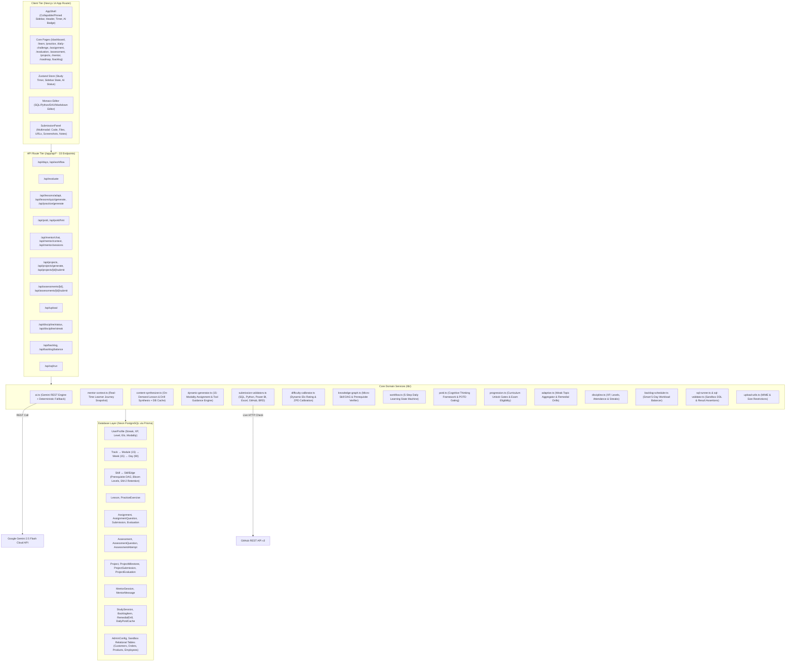
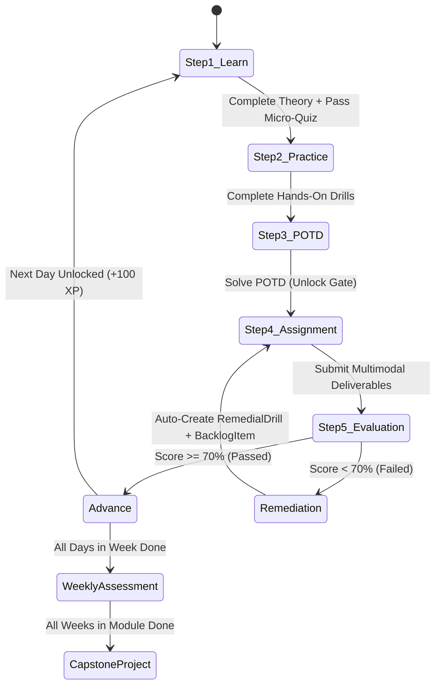

# Praxis OS — Complete Codebase Architecture Analysis

> **Application:** Praxis OS — An AI-Native Learning Management System (LMS) and Career Accelerator modeled after an intensive bootcamp, engineered to train candidates for ₹12,00,000/year (12 LPA) Data Analyst & Analytics Engineering roles in Tier-1 Global Capability Centers (GCCs) and product firms.

---

## 1. Technology Stack Matrix

| Layer | Technology | Role & Implementation Details |
|---|---|---|
| **Framework** | Next.js 14.2.15 (App Router, React 18) | Hybrid server/client rendering, nested route layouts, server actions & API handlers |
| **Language** | TypeScript | Strict type safety across client components, database schemas, and API contracts |
| **Database & ORM** | PostgreSQL (Neon Serverless) via Prisma ORM | Production connection pool via `DATABASE_URL` and direct connection via `DIRECT_URL`. Schema in [schema.prisma](file:///c:/Users/Sharun1/Downloads/LMS/LMS/prisma/schema.prisma) |
| **Local SQL Sandbox** | SQLite / In-Memory Table Assertions | Interactive in-sandbox DDL datasets (`customers`, `products`, `orders`, `order_items`, `employees`) executed via Prisma `$queryRawUnsafe` / `$executeRawUnsafe` |
| **AI Engine** | Google Gemini 2.5 Flash / 2.0 Flash (Primary) | Direct REST invocation to `generativelanguage.googleapis.com/v1beta/models/${model}:generateContent` with JSON mode support and strict 45s timeout |
| **AI Fallback** | Deterministic Rule-Based Engine | Offline heuristic evaluators (regex pattern matching, AST checks, domain validators) ensuring 100% platform availability if Gemini is offline |
| **State Management** | Zustand (`useAppStore`) | Client-side study timer (`StudyTimer`), active streak, sidebar pin state, AI connectivity status |
| **Styling & Design System** | Tailwind CSS 3.4 + Custom shadcn/ui | Tailored enterprise palette (`masai` tokens, indigo accents, emerald pass states, slate typography), Radix UI / Base UI primitives |
| **Code Editor** | Monaco Editor (`@monaco-editor/react`) | In-browser SQL, Python, DAX, and Markdown editor with syntax highlighting and schema hints |
| **Visualizations** | Recharts | Radar charts for weekly exam skill gap diagnostics, bar charts for weekly study velocity |
| **Markdown Engine** | react-markdown + remark-gfm | Formatted theory lessons, cheatsheets, and AI evaluation feedback with code block formatting |
| **File Deliverables** | Next.js Multipart Form Uploads | Client-side file upload utility storing deliverables up to 25MB in `public/uploads/` via [upload/route.ts](file:///c:/Users/Sharun1/Downloads/LMS/LMS/app/api/upload/route.ts) |
| **Deep File Extraction** | `exceljs`, `pdf-parse`, `jszip`, `mammoth` | Multi-format content extractor in [file-parser.ts](file:///c:/Users/Sharun1/Downloads/LMS/LMS/lib/file-parser.ts): parses Excel workbook formulas & grids, Jupyter notebook cells & outputs, Power BI `DataModelSchema` (DAX measures & star schema), PDF pages/text, DOCX headings/body, and Python scripts |
| **Effects & Feedback** | canvas-confetti | Milestone and test passing celebrations |

---

## 2. Master Feature Inventory & Platform Capabilities

Praxis OS provides a comprehensive suite of learning, practice, evaluation, and AI coaching features:

| Category | Feature Name | Description & Functional Capabilities | Where in Code / Docs |
|---|---|---|---|
| **Daily Learning Loop** | **5-Step Daily Stepper** | Deterministic 5-step daily cycle: `LEARN` → `PRACTICE` → `POTD` → `ASSIGNMENT` → `EVALUATION`. Visualized in header stepper with step completion states. | [DailyStepper.tsx](file:///c:/Users/Sharun1/Downloads/LMS/LMS/components/DailyStepper.tsx), [workflow.ts](file:///c:/Users/Sharun1/Downloads/LMS/LMS/lib/workflow.ts) |
| **Daily Learning Loop** | **Interactive Theory & Micro-Quiz** | Markdown notes, 10-second cheatsheets, JavaScript-to-Data mental model bridges, curated YouTube videos, and 3-question knowledge check MCQs. | [app/learn/[moduleId]/[dayId]/page.tsx](file:///c:/Users/Sharun1/Downloads/LMS/LMS/app/learn/[moduleId]/[dayId]/page.tsx) |
| **Daily Learning Loop** | **On-Demand Lesson Rewriter** | Rewrites any lesson into 4 distinct pedagogical modes: **Staff Engineer** (scalability/indexes), **Beginner** (ELI10 analogies), **Case Study** (Swiggy/Zepto/Netflix), or **Hinglish** (natural Hindi-English). | [app/api/lessons/adapt/route.ts](file:///c:/Users/Sharun1/Downloads/LMS/LMS/app/api/lessons/adapt/route.ts) |
| **Practice & Sandbox** | **SQL & Code Sandbox** | In-browser Monaco editor, database schema viewer (`customers`, `products`, `orders`, `order_items`, `employees`), real-time query execution against SQLite datasets with millisecond execution timer. | [app/practice/[dayId]/page.tsx](file:///c:/Users/Sharun1/Downloads/LMS/LMS/app/practice/[dayId]/page.tsx), [sql-runner.ts](file:///c:/Users/Sharun1/Downloads/LMS/LMS/lib/sql-runner.ts) |
| **Practice & Sandbox** | **Graduated Elo-Calibrated Drills** | 3 hands-on drills per day dynamically generated matching learner Elo rating: Drill 1 (syntax verify), Drill 2 (multi-condition), Drill 3 (edge-case trap), with progressive 3-level hints. | [content-synthesizer.ts](file:///c:/Users/Sharun1/Downloads/LMS/LMS/lib/content-synthesizer.ts), [difficulty-calibrator.ts](file:///c:/Users/Sharun1/Downloads/LMS/LMS/lib/difficulty-calibrator.ts) |
| **Cognitive Challenges** | **Dynamic Problem of the Day (POTD)** | Daily authentic company scenario (Zepto, Razorpay, Blinkit, Swiggy) synthesized by AI and cached in DB per calendar date. | [potd.ts](file:///c:/Users/Sharun1/Downloads/LMS/LMS/lib/potd.ts), [app/daily-challenge/page.tsx](file:///c:/Users/Sharun1/Downloads/LMS/LMS/app/daily-challenge/page.tsx) |
| **Cognitive Challenges** | **Thinking Framework Scaffolding** | Cognitive architecture breakdown: Business Objective, Data Grain (Input vs Output grain), Corner Cases & Traps, Recommended Mental Steps. | [potd.ts](file:///c:/Users/Sharun1/Downloads/LMS/LMS/lib/potd.ts) |
| **Cognitive Challenges** | **Socratic POTD Hint Copilot** | 3-level Hint Ladder (Directional → Relational Blueprint → Syntax Blueprint) + AI Hint API that guides without spoiling the answer. | [app/api/potd/hint/route.ts](file:///c:/Users/Sharun1/Downloads/LMS/LMS/app/api/potd/hint/route.ts) |
| **Discipline & Progression** | **POTD Unlock Gating** | Strict gate: After completing day tasks, next day **remains locked** until today's POTD is solved. Solving awards +50 XP and 30 min study time. | [app/api/days/[dayId]/route.ts](file:///c:/Users/Sharun1/Downloads/LMS/LMS/app/api/days/[dayId]/route.ts) |
| **Submissions** | **Multimodal Deliverable Submissions** | Accepts Code Editor input, File Uploads (.xlsx, .pbix, .ipynb, .pdf, .zip up to 25MB), Live URLs (GitHub, Colab, Power BI), Screenshots (visual dashboard proofs), and Architectural Notes. | [SubmissionPanel.tsx](file:///c:/Users/Sharun1/Downloads/LMS/LMS/components/SubmissionPanel.tsx), [app/api/upload/route.ts](file:///c:/Users/Sharun1/Downloads/LMS/LMS/app/api/upload/route.ts) |
| **Submissions** | **5-Clarity Tool Guidance Blocks** | Displays Primary Tool, Platform Availability, Accepted Deliverables, Evaluation Method, and Mandatory Submission Fields tailored to 15 modalities. | [AssignmentBrief.tsx](file:///c:/Users/Sharun1/Downloads/LMS/LMS/components/AssignmentBrief.tsx), [dynamic-generator.ts](file:///c:/Users/Sharun1/Downloads/LMS/LMS/lib/dynamic-generator.ts) |
| **Evaluation & Grading** | **Deep File Content Analysis Engine** | Parses actual file contents via [file-parser.ts](file:///c:/Users/Sharun1/Downloads/LMS/LMS/lib/file-parser.ts): extracts formulas (`=XLOOKUP`, `=SUMIFS`) from Excel, code cells & outputs from Jupyter notebooks, DAX measures and relationships from Power BI `.pbix`, and full text from PDFs/DOCX. Injects extracted structure into Gemini prompts for genuine assessment. | [file-parser.ts](file:///c:/Users/Sharun1/Downloads/LMS/LMS/lib/file-parser.ts), [app/api/evaluate/route.ts](file:///c:/Users/Sharun1/Downloads/LMS/LMS/app/api/evaluate/route.ts) |
| **Evaluation & Grading** | **Strict Dual-Scoring Engine** | Unchanged starter code guard (immediate 0%) + Deterministic execution check (0–40 pts based on real formulas/cells/AST) + Gemini AI Rubric (0–60 pts). Partial credit capped at 20% if core execution fails. | [app/api/evaluate/route.ts](file:///c:/Users/Sharun1/Downloads/LMS/LMS/app/api/evaluate/route.ts), [submission-validators.ts](file:///c:/Users/Sharun1/Downloads/LMS/LMS/lib/submission-validators.ts) |
| **Evaluation & Grading** | **Live GitHub API Deep Verifier** | Verifies public GitHub repositories via real HTTP calls: repo size, descriptions, commits, README.md decoded content, and recursive git tree structure (Dockerfile, tests, CI pipelines). | [submission-validators.ts](file:///c:/Users/Sharun1/Downloads/LMS/LMS/lib/submission-validators.ts) |
| **Evaluation & Grading** | **Comprehensive Scorecards** | 6-dimension rubric breakdown, strengths, weak areas, production refactoring code diff, constructive feedback, and targeted remedial drills. | [app/evaluation/[subId]/page.tsx](file:///c:/Users/Sharun1/Downloads/LMS/LMS/app/evaluation/[subId]/page.tsx) |
| **AI Copilot** | **Axiom — Socratic Career Copilot** | Platform-aware AI mentor with full access to active module, weak areas, scores, and study streak. 4 modes: Socratic, Debugger, Business, Interview. | [mentor-context.ts](file:///c:/Users/Sharun1/Downloads/LMS/LMS/lib/mentor-context.ts), [app/mentor/page.tsx](file:///c:/Users/Sharun1/Downloads/LMS/LMS/app/mentor/page.tsx) |
| **AI Copilot** | **Multi-Session Chat History** | Persistent chat sessions with automatic title generation from first message, deletion, and context persistence. | [app/api/mentor/sessions/route.ts](file:///c:/Users/Sharun1/Downloads/LMS/LMS/app/api/mentor/sessions/route.ts) |
| **Adaptive Intelligence** | **Weak Area Detection & Remediation** | Identifies topics scoring < 75% across evaluations and assessments. Auto-creates `RemedialDrill` and adapts next day's assignment. | [adaptive.ts](file:///c:/Users/Sharun1/Downloads/LMS/LMS/lib/adaptive.ts) |
| **Adaptive Intelligence** | **Smart 5-Day Schedule Balancer** | Distributes accumulated backlog items evenly across the next 5 days (max 2 per day) to maintain manageable workloads. | [backlog-scheduler.ts](file:///c:/Users/Sharun1/Downloads/LMS/LMS/lib/backlog-scheduler.ts) |
| **Knowledge Graph** | **Micro-Skills DAG & Prerequisites** | 50+ micro-skills mapped with Bloom's taxonomy levels (1–6), Bayesian posterior mastery scores, SM-2 spaced repetition fields, and prerequisite check warnings. | [knowledge-graph.ts](file:///c:/Users/Sharun1/Downloads/LMS/LMS/lib/knowledge-graph.ts), [skills-data.mjs](file:///c:/Users/Sharun1/Downloads/LMS/LMS/prisma/skills-data.mjs) |
| **Skill Rating** | **Dynamic Elo Rating Engine** | Learner Elo rating starts at 1200 and recalculates dynamically ($K=32$) based on challenge outcomes, targeting the Zone of Proximal Development (+50 Elo). | [difficulty-calibrator.ts](file:///c:/Users/Sharun1/Downloads/LMS/LMS/lib/difficulty-calibrator.ts) |
| **Assessments** | **Monday Benchmark Exams** | 90-minute timed weekly examinations (MCQ + Code). Unlocked only when all days in the week are completed with average score ≥ 70%. | [app/assessment/[assessId]/page.tsx](file:///c:/Users/Sharun1/Downloads/LMS/LMS/app/assessment/[assessId]/page.tsx) |
| **Assessments** | **Radar Skill Gap Diagnostics** | Post-exam reports featuring Recharts radar charts visualizing competencies and knowledge gaps. | [app/assessment/[assessId]/report/page.tsx](file:///c:/Users/Sharun1/Downloads/LMS/LMS/app/assessment/[assessId]/report/page.tsx) |
| **Capstones** | **15 7-Day Industry Projects** | Comprehensive capstones per module with 7 daily milestone checklists, deliverable evidence uploads, and recruiter-focused evaluations. | [app/projects/[projId]/page.tsx](file:///c:/Users/Sharun1/Downloads/LMS/LMS/app/projects/[projId]/page.tsx) |
| **Gamification** | **XP, Levels & Title Progression** | Experience points (+100 day, +50 POTD, +250 exam, +500 capstone, +2/min study) with 5 career titles from Apprentice to Staff Analytics Architect. | [discipline.ts](file:///c:/Users/Sharun1/Downloads/LMS/LMS/lib/discipline.ts) |
| **Discipline** | **Study Timer & Activity Tracking** | Client-side timer in Zustand, auto-syncing every 60 seconds to database, tracking daily goals and attendance percentage. | [StudyTimer.tsx](file:///c:/Users/Sharun1/Downloads/LMS/LMS/components/StudyTimer.tsx), [store.ts](file:///c:/Users/Sharun1/Downloads/LMS/LMS/lib/store.ts) |
| **Discipline** | **Consecutive Streak Engine** | Tracks consecutive days of activity across study sessions and submissions, encouraging daily consistency. | [discipline.ts](file:///c:/Users/Sharun1/Downloads/LMS/LMS/lib/discipline.ts) |
| **Curriculum Navigation** | **Interactive Roadmap Tree** | Interactive visual roadmap of all 15 modules and 90 days, with completion tracking and locked/unlocked indicators. | [app/roadmap/page.tsx](file:///c:/Users/Sharun1/Downloads/LMS/LMS/app/roadmap/page.tsx), [RoadmapClient.tsx](file:///c:/Users/Sharun1/Downloads/LMS/LMS/components/roadmap/RoadmapClient.tsx) |
| **Administration** | **Admin Studio** | Configure active Gemini models (`gemini-2.5-flash`), evaluation strictness (85%), and passing thresholds (70%). | [app/admin/studio/page.tsx](file:///c:/Users/Sharun1/Downloads/LMS/LMS/app/admin/studio/page.tsx) |

---

## 3. High-Level Architecture Diagram

---

## 4. Database Schema & Data Models

The Prisma schema ([schema.prisma](file:///c:/Users/Sharun1/Downloads/LMS/LMS/prisma/schema.prisma)) models the complete lifecycle of an intensive technical bootcamp:

### 3.1. Learner Profile & Configuration
- **`UserProfile`**: Represents the learner. Contains gamification metrics (`xp`, `level`), streak metrics (`currentStreak`, `longestStreak`, `totalStudyMins`), career targets (`targetRole`, `experienceLevel`, `dailyStudyGoal`), and adaptive learning markers (`eloRating` defaulting to 1200, `modalityPreference` defaulting to `VIDEO_CODE`, `activeDayId`, `activeModuleId`).
- **`AdminConfig`**: Global settings controlling platform evaluation behavior (`activeModel` defaulting to `gemini-2.5-flash`, evaluation `strictness` defaulting to 85%, and `passingThreshold` defaulting to 70%).

### 3.2. Curriculum & Micro-Skills Knowledge Graph
- **`Track` (1)**: Top-level career track ("Data Analyst & Analytics Engineering (12 LPA GCC Track)").
- **`Module` (15)**: Ordered 0 through 14, spanning Excel, SQL, Warehousing, Power BI, Python, Pipelines, dbt, Product Analytics, Automation, AI, Cloud, Governance, Business Analysis, Statistics, and Big 4 Interviews.
- **`Week` (15)**: Maps 1:1 with curriculum modules.
- **`Day` (90)**: 6 days per module. Tracks status (`isUnlocked`, `isCompleted`, `theoryCompleted`, `practiceCompleted`, `score`, `estimatedMins`).
- **`Skill`**: Micro-skill nodes in the competency DAG. Tracks `slug`, `name`, `category`, `bloomLevel` (1=Remember to 6=Create), `masteryScore` (0.0 to 1.0 Bayesian posterior), `eloRating`, and SuperMemo SM-2 spaced repetition fields (`easeFactor`, `interval`, `repetitions`, `nextReviewAt`, `lastPracticed`).
- **`SkillEdge`**: Directed prerequisite graph relationships between skills (`fromSkillId`, `toSkillId`, `weight`).

### 3.3. Daily Content & Dynamic Mission Entities
- **`Lesson`**: Associated 1:1 with `Day`. Stores theory notes in markdown (`content`), syntax cheatsheet (`cheatSheet`), micro knowledge checks in JSON (`quickQuiz`), video search queries (`videoSearchQuery`), and curated video resources (`resources`).
- **`PracticeExercise`**: 1:N with `Day`. Stores hands-on drills with problem statement, initial template (`starterCode`), schema metadata (`sampleData`), reference code (`solution`), and progressive hints (`hints` JSON array).
- **`Assignment`**: 1:N with `Day`. Contains business mission brief (`description`), deadline (`deadlineHours`), evaluation rubric (`rubric`), modality type (`type`), and tool guidance metadata (`toolGuidance` JSON) and tested competencies (`skillsTested` JSON).
- **`AssignmentQuestion`**: 1:N with `Assignment`. Stores prompt, starter code, reference solution for automated assertion (`referenceSolution`), weight, and adaptive markers (`isAdaptive`, `adaptiveReason`).

### 3.4. Multimodal Submissions & Evaluation
- **`Submission`**: Captures learner deliverables. Supports multimodal evidence: `submittedCode` (code editor text), `fileUrls` (JSON array of uploaded files like `.xlsx`, `.pbix`, `.ipynb`), `screenshotUrls` (JSON array of dashboard visual proofs), `externalUrl` (GitHub repository or Colab URL), `notes` (learner architecture explanation), and `submissionType` (`CODE`, `FILE`, `URL`, `MIXED`).
- **`Evaluation`**: 1:1 with `Submission`. Stores 0–100 `score`, `passed` boolean, `strengths` (JSON), `weakAreas` (JSON), `rubricScores` breakdown (JSON), production-grade `codeDiff`, `detailedFeedback`, and `remedialTasks` (JSON).

### 3.5. Weekly Assessments & Capstones
- **`Assessment`**: 90-minute timed Monday benchmark exams tied to each `Week`.
- **`AssessmentQuestion`**: Questions of type `MCQ` or `CODE` with options, correct answer, starter code, rubric, and weight.
- **`AssessmentAttempt`**: Stores score, passed status, submitted answers (`answersJson`), topic radar scores (`skillGaps`), and time taken.
- **`Project`**: 7-day capstone projects tied to each `Module`. Contains `businessBrief` and 7 `ProjectMilestone` items.
- **`ProjectMilestone`**: Daily milestones tracking `deliverable`, completion status, submitted URLs (`submittedUrl`), uploaded files (`submittedFile`), notes, and timestamps.
- **`ProjectSubmission` & `ProjectEvaluation`**: Captures final capstone deliverables and recruiter-grade evaluation (`overallScore`, `technicalScore`, `businessScore`, `recruiterSummary`, `feedback`).

### 3.6. Axiom AI Copilot, Discipline & Sandboxes
- **`MentorSession` & `MentorMessage`**: Chat history grouped by session, with persistent conversation titles and mode tracking (`socratic`, `debugger`, `business`, `interview`).
- **`StudySession`**: Time logs recorded by the study timer and POTD completion flags.
- **`BacklogItem` & `RemedialDrill`**: Rescheduled overdue assignments and automated drills for weak topics.
- **`DailyPotdCache`**: Caches dynamically synthesized POTD records by calendar date (`date_key`).
- **`Customer`, `Product`, `Order`, `OrderItem`, `Employee`**: Relational tables used for SQL execution drills and automated query evaluation.

---

## 5. 15-Module / 90-Day Curriculum Structure

The full curriculum is defined in [curriculum-data.mjs](file:///c:/Users/Sharun1/Downloads/LMS/LMS/prisma/curriculum-data.mjs) and seeded via [seed.mjs](file:///c:/Users/Sharun1/Downloads/LMS/LMS/prisma/seed.mjs):

| Module | Order | Title | Days | Modality | Primary Deliverables & Capstone Theme |
|---|---|---|---|---|---|
| **0** | 0 | Excel + Business Productivity | Days 1–6 | `EXCEL` | Modern lookups (XLOOKUP), dynamic arrays, Pivot Tables, 3-Statement financial models, Sensitivity analysis, Power Query M-code ETL. Capstone: *Executive Financial & Sales Operations Model*. |
| **1** | 1 | Production SQL & Analytical Problem Solving | Days 7–12 | `SQL` | Execution order, JOIN mechanics & fan-out mitigation, GROUP BY/HAVING, Subqueries, Window framing, CTEs. Capstone: *Multi-Touch Revenue Attribution & Churn Pipeline*. |
| **2** | 2 | Data Modeling & Data Warehousing | Days 13–18 | `SQL` | Kimball dimensional architecture, Star/Snowflake schemas, SCD Types 1/2/3, Factless fact tables, ER diagrams. Capstone: *Enterprise Omni-Channel Retail Data Warehouse*. |
| **3** | 3 | Enterprise Power BI + Advanced DAX | Days 19–24 | `POWER_BI` | Tabular models, Star schema data relationships, CALCULATE & filter context, Time intelligence DAX, Row-Level Security, C-Suite dashboard UX. Capstone: *SaaS Executive Command Center Dashboard*. |
| **4** | 4 | Python for Analytics & Automation | Days 25–30 | `PYTHON` | Vectorized NumPy computations, Pandas DataFrames, exploratory data analysis, data cleansing, automated Excel/PDF generation. Capstone: *Automated E-Commerce Anomaly Detection & Reporting Engine*. |
| **5** | 5 | ETL/ELT & Data Pipelines | Days 31–36 | `PYTHON` | REST API extraction with pagination, webhook handling, incremental loads, data validation, pipeline alerting. Capstone: *Real-Time Multi-Source Lead Ingestion Pipeline*. |
| **6** | 6 | Analytics Engineering with dbt | Days 37–42 | `DBT_GIT` | dbt Core CLI, Git branching workflows, staging/intermediate/marts layering, Jinja templating, schema testing, documentation DAGs. Capstone: *Production dbt Project with CI/CD & Automated Data Quality*. |
| **7** | 7 | Business & Product Analytics | Days 43–48 | `PRODUCT_ANALYTICS` | Cohort retention matrices, funnel conversion drop-off, customer lifetime value (LTV:CAC), RFM customer segmentation. Capstone: *Product Growth & Retention Deep-Dive Presentation*. |
| **8** | 8 | Power Platform & Workflow Automation | Days 49–54 | `AUTOMATION` | Power Automate cloud flows, webhook listeners, automated executive alert routing, scheduled batch processing, n8n. Capstone: *Automated Incident Response & KPI Breach Notification Flow*. |
| **9** | 9 | AI for Analytics | Days 55–60 | `PROMPT_ENG` | Few-shot prompting for metric synthesis, structured JSON extraction with LLMs, text-to-SQL validation agents, synthetic data generation. Capstone: *Autonomous AI SQL Analyst Agent & Executive Copilot*. |
| **10** | 10 | Cloud & Modern Data Platforms | Days 61–66 | `CLOUD_ARCHITECTURE` | Snowflake architecture, virtual warehouse sizing, zero-copy cloning, time travel, cloud role-based access control, cost governance. Capstone: *Cloud Lakehouse Migration & FinOps Optimization Architecture*. |
| **11** | 11 | Data Governance, Quality & Security | Days 67–72 | `COMPLIANCE` | India DPDP Act compliance, GDPR principles, data cataloging, PII column masking, Great Expectations data quality gates. Capstone: *Enterprise DPDP Governance Framework & Data Quality Gatekeeper*. |
| **12** | 12 | Business Analysis & Stakeholder Engineering | Days 73–78 | `BRD` | Writing formal BRDs/FRDs, BPMN 2.0 process flow diagrams, stakeholder requirement interviews, executive business case decks. Capstone: *Complete FinTech Platform Modernization BRD & Business Case*. |
| **13** | 13 | Statistics, Experimentation & Commercial Analytics | Days 79–84 | `STATISTICS` | Hypothesis formulation, A/B test sample sizing, p-values and confidence intervals, uplift modeling, business trade-off analysis. Capstone: *Commercial Pricing Experimentation & Incrementality Analysis*. |
| **14** | 14 | Big 4 Interview + Case Study + Job Engine | Days 85–90 | `INTERVIEW_PREP` | Live SQL live-coding rounds, guesstimate frameworks, Big 4 consulting case studies, resume audit, recruiter pitch decks. Capstone: *12 LPA Master Portfolio & Recruiter Showcase Package*. |

---

## 6. Core Workflow: The 5-Step Daily Learning State Machine

The platform is driven by deterministic progression computed in [workflow.ts](file:///c:/Users/Sharun1/Downloads/LMS/LMS/lib/workflow.ts) and visualised by [DailyStepper.tsx](file:///c:/Users/Sharun1/Downloads/LMS/LMS/components/DailyStepper.tsx):

### The 5 Daily Steps:
1. **Step 1: LEARN (`/learn/[moduleId]/[dayId]`)**
   - Learner reviews markdown notes, cheatsheets, and curated video guides.
   - Includes **JavaScript-to-Data Mental Model Bridges** (e.g., explaining SQL filtering via `array.filter`, projections via `array.map`, and aggregations via `array.reduce`).
   - Learners can rewrite the lesson on-demand via `/api/lessons/adapt` into 4 styles: **Staff Engineer**, **Beginner**, **Case Study**, or **Hinglish**.
   - Must pass a 3-question Micro-Quiz (dynamically generated via `/api/lessons/quiz/generate` or served from curriculum data).
   - Marks `theoryCompleted = true`.

2. **Step 2: PRACTICE (`/practice/[dayId]`)**
   - Interactive Monaco editor sandbox with schema viewer (`customers`, `products`, `orders`, etc.).
   - 3 graduated drills synthesized on demand and calibrated to learner Elo rating via [content-synthesizer.ts](file:///c:/Users/Sharun1/Downloads/LMS/LMS/lib/content-synthesizer.ts).
   - Real-time SQL execution against the database with progressive hints (Level 1 direction, Level 2 structure, Level 3 syntax).
   - Marks `practiceCompleted = true`.

3. **Step 3: DAILY POTD (`/daily-challenge?dayNumber=N`)**
   - High-rigor Problem of the Day challenge generated dynamically via [potd.ts](file:///c:/Users/Sharun1/Downloads/LMS/LMS/lib/potd.ts).
   - Features real companies (Zepto, Swiggy, Razorpay, CRED, Blinkit).
   - Includes a **Thinking Framework** (Business objective, input/output data grain, corner cases/traps, recommended mental steps).
   - Provides a 3-level Hint Ladder and Socratic AI Hint Copilot (`/api/potd/hint`).
   - **POTD Gating Rule**: When a day's curriculum tasks are completed, the system checks `hasSolvedTodayPOTD()`. The subsequent day's lesson **remains locked** until today's POTD is solved!

4. **Step 4: ASSIGNMENT (`/assignment/[assignId]`)**
   - Industry-grade graded mission. If not yet created in the DB, it is dynamically synthesized by [dynamic-generator.ts](file:///c:/Users/Sharun1/Downloads/LMS/LMS/lib/dynamic-generator.ts).
   - Guided by [AssignmentBrief.tsx](file:///c:/Users/Sharun1/Downloads/LMS/LMS/components/AssignmentBrief.tsx) presenting **5 Clarity Blocks**:
     1. Primary Commercial Tool (e.g. Platform SQL Sandbox, Excel, Power BI Desktop, Colab, VS Code + dbt)
     2. Tool Setup & Platform Availability
     3. Accepted Submission Deliverables
     4. Evaluation Methodology (Deterministic + AI Rubric)
     5. Mandatory Fields & Skills Tested
   - Submitted via [SubmissionPanel.tsx](file:///c:/Users/Sharun1/Downloads/LMS/LMS/components/SubmissionPanel.tsx) supporting code, uploaded `.xlsx`/`.pbix`/`.ipynb` files, screenshots, URLs, and architectural notes.

5. **Step 5: EVALUATION (`/evaluation/[subId]`)**
   - Immediate scorecard evaluation processed by [app/api/evaluate/route.ts](file:///c:/Users/Sharun1/Downloads/LMS/LMS/app/api/evaluate/route.ts).
   - 6-dimension rubric breakdown: Correctness (40%), Query/Model Logic (20%), Edge Cases (15%), Performance (10%), Readability (10%), Business Explanation (5%).
   - If `passed` (Score ≥ 70%): Marks day complete, unlocks next day (subject to POTD gate), triggers adaptive next-day assignment, awards +100 XP.
   - If `failed` (< 70%): Creates a `RemedialDrill` for the top weak area and a `BacklogItem` for redo.

---

## 7. AI Engine Architecture

Praxis OS implements a dual-engine architecture in [ai.ts](file:///c:/Users/Sharun1/Downloads/LMS/LMS/lib/ai.ts):

### 6.1. Primary: Google Gemini 2.5 Flash
- Direct REST endpoint: `POST https://generativelanguage.googleapis.com/v1beta/models/${model}:generateContent?key=${API_KEY}`
- Execution parameters: `temperature: 0.2` (deterministic evaluation), `topP: 0.95`.
- Structured JSON output enforced via `generationConfig.responseMimeType: "application/json"`.
- Strict 45-second timeout with `AbortController`.
- Dynamic model selection: Overridable at runtime via `AdminConfig.activeModel`.

### 6.2. Offline Deterministic Rule-Based Fallback
If the Gemini API key is missing, network fails, or the request times out, the system automatically falls back to deterministic rule engines:
- **Assignment Evaluation**: [submission-validators.ts](file:///c:/Users/Sharun1/Downloads/LMS/LMS/lib/submission-validators.ts) executes syntactic and structural validation checks per modality.
- **Mentor Chat**: Generates structured 4-step framework guidance.
- **Capstone Evaluation**: Applies standardized baseline project rubrics.
- **JIT Lesson & Drill Generation**: Returns pre-engineered fallback masterclasses and SQL drill templates.

### 6.3. Socratic AI Copilot: Axiom
The built-in mentor **Axiom** is platform-aware via [mentor-context.ts](file:///c:/Users/Sharun1/Downloads/LMS/LMS/lib/mentor-context.ts):
- Injects live student context: name, current module/day, overall percentage, identified weak areas (< 75% score), strong areas (≥ 85%), recent assignment scores, study hours, active streak, and JavaScript background.
- 4 Operational Modes:
  1. `socratic`: Guides through mental models and execution order without giving away code.
  2. `debugger`: Analyzes anti-patterns, non-SARGable predicates, and join fan-outs.
  3. `business`: Translates data metrics into commercial business KPIs (CAC, LTV, Churn, ARR).
  4. `interview`: Conducts live technical mock interviews calibrated to learner weak spots.
- Multi-session management with auto-titling and deletion in [app/api/mentor/sessions/route.ts](file:///c:/Users/Sharun1/Downloads/LMS/LMS/app/api/mentor/sessions/route.ts).

---

## 8. Submission Validation & Evaluation Pipeline

The evaluation route ([app/api/evaluate/route.ts](file:///c:/Users/Sharun1/Downloads/LMS/LMS/app/api/evaluate/route.ts)) implements an enterprise evaluation pipeline:

### Step 0: Strict Guard Rails
- Checks for unchanged starter code or empty submissions via `isUnchangedStarterCode()`.
- Unchanged templates receive an immediate 0% score, marked failed, without burning AI quota.

### Step 1: Modality-Specific Deterministic Validation (0–40 Points)
Implemented in [submission-validators.ts](file:///c:/Users/Sharun1/Downloads/LMS/LMS/lib/submission-validators.ts):
- **SQL**: Executes student query against SQLite sandbox tables via Prisma `$queryRawUnsafe`. Compares row count, column structure, and result rows against `referenceSolution`.
- **Python**: Validates `.ipynb`/`.py` upload or Colab URL (+20 pts), imports of `pandas`/`numpy` (+8 pts), vectorized transforms like `.groupby()`, `.merge()`, `.agg()` (+8 pts), and script length (+4 pts).
- **Power BI**: Validates live published URL or `.pbix` model file (+20 pts), dashboard screenshots (+10 pts), and DAX measures using `CALCULATE`, `FILTER`, `DIVIDE` (+10 pts).
- **Excel**: Validates `.xlsx` workbook upload (+20 pts), visual screenshots (+10 pts), and modern formula definitions (`XLOOKUP`, `INDEX/MATCH`, `SUMIFS`, `FILTER`) (+10 pts).
- **dbt / Git**: Performs a **live HTTP call to GitHub REST API** (`api.github.com/repos/{owner}/{repo}`). Validates repo reachability (+20 pts), repository size > 0 (+10 pts), repo description (+5 pts), and `README.md` presence (+5 pts).
- **BRD / Documentation**: Validates attached specification files (+15 pts), markdown heading structure (+12 pts), and character depth (+13 pts).

### Step 2: Qualitative Rubric Scoring via Gemini (0–60 Points)
The submission is passed to Gemini with assignment prompts, gold-standard benchmark solutions, learner notes, and deliverable audits. It evaluates query logic, edge-case resilience, performance, readability, and business explanations.

### Step 3: Strict Score Combination & Partial Credit Cap
- If deterministic correctness is 0 (query fails or no required files uploaded), **maximum partial credit is capped at 20%**, ensuring invalid code never passes.
- Final Score = `Deterministic Correctness (0–40) + AI Rubric Dimensions (0–60)`.
- Passing criteria: Final Score ≥ `AdminConfig.passingThreshold` (default 70%).

### Step 4: Auto-Progression, Remediation & Skill Graph Update
- If passed: Updates day `isCompleted = true`, unlocks next sequential day, updates `Skill.masteryScore`, triggers adaptive assignment generation for the next day, and awards +100 XP.
- If failed: Automatically creates a `RemedialDrill` and schedules a `BacklogItem`.

---

## 9. Dynamic Content Generation & Adaptive Engine

### 8.1. JIT Lesson & Drill Synthesis ([content-synthesizer.ts](file:///c:/Users/Sharun1/Downloads/LMS/LMS/lib/content-synthesizer.ts))
When a learner navigates to a day whose content is not pre-seeded:
1. `synthesizeLessonOnDemand(dayId)`: Generates concise, visual-first lesson notes with JavaScript analogies, a 10-second cheatsheet, and a 3-question micro-quiz. Persists to database for instant future retrieval.
2. `synthesizeDrillsOnDemand(dayId)`: Generates 3 graduated drills matched to the learner's Elo rating:
   - Drill 1: Syntax verification (Elo target - 150)
   - Drill 2: Multi-condition scenario (Elo target)
   - Drill 3: Edge-case optimization (Elo target + 150)

### 8.2. Dynamic Elo Difficulty Calibrator ([difficulty-calibrator.ts](file:///c:/Users/Sharun1/Downloads/LMS/LMS/lib/difficulty-calibrator.ts))
- Tracks learner Elo rating in `UserProfile.eloRating` (default 1200).
- Applies standard competitive Elo formulation ($K=32$):
  $$E = \frac{1}{1 + 10^{(\text{ChallengeElo} - \text{LearnerElo}) / 400}}$$
  $$\Delta = \text{round}(K \times (\text{Success} - E))$$
- Calculates Zone of Proximal Development (ZPD) as `targetElo = learnerElo + 50` for challenging content synthesis.

### 8.3. Micro-Skills DAG & Prerequisites ([knowledge-graph.ts](file:///c:/Users/Sharun1/Downloads/LMS/LMS/lib/knowledge-graph.ts))
- 15 modules map to 50+ micro-skills defined in [skills-data.mjs](file:///c:/Users/Sharun1/Downloads/LMS/LMS/prisma/skills-data.mjs).
- `checkPrerequisitesMet(skillSlug)`: Verifies that all prerequisite skills have achieved at least 70% mastery (`masteryScore >= 0.70`).
- If unmet, warnings are displayed on the daily lesson view to guide remediation.

### 8.4. Adaptive Assignment Adaptation ([adaptive.ts](file:///c:/Users/Sharun1/Downloads/LMS/LMS/lib/adaptive.ts))
- `detectWeakTopics()`: Aggregates the last 20 evaluations and 5 weekly assessment radar scores. Identifies competencies scoring below 75%.
- `generateAdaptiveAssignmentForNextDay()`:
  - If learner scored < 75%: Next day's prompt weaves in reinforcement of their specific weak area.
  - If learner scored ≥ 88%: Next day's prompt is elevated into a top-tier interview challenge with multi-table partitioning and scale constraints.

---

## 10. Problem of the Day (POTD) Engine

The POTD system in [potd.ts](file:///c:/Users/Sharun1/Downloads/LMS/LMS/lib/potd.ts) provides daily interview challenge problem solving:

- **Dynamic Synthesis**: Synthesizes a daily challenge based on active curriculum topic, weak areas, and difficulty tier.
- **Cache Persistence**: Stored in `daily_potd_cache` keyed by `YYYY-MM-DD` so all accesses on a day receive the identical challenge.
- **Thinking Framework**: Injects structured cognitive scaffolding:
  1. Business Objective
  2. Input Grain vs Output Grain definitions
  3. Corner Cases & Traps
  4. Recommended Mental Steps
- **3-Level Hint Ladder**: Directional Clue → Relational Blueprint → Syntax Blueprint.
- **Socratic Hint API (`POST /api/potd/hint`)**: Axiom reviews the student's partial code and error message, offering guiding questions without revealing the solution.
- **Rewards**: Solving POTD awards 30 minutes study time, +50 XP, increments streak, and unlocks the next curriculum day.

---

## 11. Complete API Route Catalog (33 Endpoints)

| Route | Methods | Purpose & Handler Details |
|---|---|---|
| `/api/admin/config` | `GET`, `PATCH` | Read and update active AI model, strictness, and passing threshold in `AdminConfig`. |
| `/api/ai/status` | `GET` | Health check for Gemini API key configuration and active model name. |
| `/api/analytics` | `GET` | Aggregated analytics: weekly study hours, topic proficiencies, rubric radar, XP progression. |
| `/api/assessments/[assessId]` | `GET` | Fetches weekly Monday assessment details, questions, and attempt history. |
| `/api/assessments/[assessId]/submit` | `POST` | Grades MCQ and code questions; calculates skill gaps and records `AssessmentAttempt`. |
| `/api/assignments/generate` | `POST` | Triggers dynamic AI assignment generation for a specific day. |
| `/api/assignments/[assignId]` | `GET` | Retrieves assignment metadata, questions, rubrics, and tool guidance. |
| `/api/assignments/[assignId]/submissions` | `GET` | Fetches learner submission history and evaluations for an assignment. |
| `/api/backlog` | `GET`, `POST`, `PATCH` | CRUD operations for overdue `BacklogItem` records and targeted `RemedialDrill` items. |
| `/api/backlog/balance` | `POST` | Rebalances pending backlog items evenly across the next 5 days (max 2/day). |
| `/api/days/[dayId]` | `GET`, `PATCH` | `GET`: Loads day, lesson (with JIT synthesis), practice drills, skills DAG, and prerequisite warnings. `PATCH`: Updates completion flags, checks **POTD Gate**, unlocks next day, awards +100 XP. |
| `/api/discipline/status` | `GET` | Returns streak, today's study minutes, goal progress, level, XP, and recent sessions. |
| `/api/discipline/streak` | `GET` | Computes consecutive day streak based on `StudySession` and `Submission` history. |
| `/api/evaluate` | `POST` | **Core Evaluator**: Validates starter code guard → deterministic validation (0–40) → Gemini rubric (0–60) → progression/remediation. |
| `/api/lessons/adapt` | `POST` | Rewrites lesson theory on demand into 4 styles: `staff`, `beginner`, `case_study`, or `hinglish`. |
| `/api/lessons/quiz/generate` | `POST` | Dynamically generates 3 real-world MCQs for any day's topic with explanations. |
| `/api/mentor/chat` | `GET`, `POST` | `GET`: Returns messages for a session. `POST`: Sends message to Axiom, auto-titles session, saves history. |
| `/api/mentor/context` | `GET` | Returns personalized greeting, dynamic suggestion chips, current topic, and weak areas. |
| `/api/mentor/sessions` | `GET`, `POST` | Lists all chat sessions or creates a fresh session. |
| `/api/mentor/sessions/[id]` | `GET`, `DELETE` | Retrieves or deletes a specific chat session and all its messages. |
| `/api/potd` | `GET`, `POST` | `GET`: Retrieves cached or dynamically synthesized POTD. `POST`: Validates solution against sandbox, awards +50 XP, logs session. |
| `/api/potd/hint` | `POST` | Socratic hint copilot providing directional guidance on student query traps. |
| `/api/practice/generate` | `POST` | AI-generates new practice drills for a specific day. |
| `/api/practice/[dayId]` | `GET` | Retrieves practice drills for a day with sample data and progressive hints. |
| `/api/profile` | `GET`, `PATCH` | Read and update `UserProfile` (name, goal, target role, modality preference). |
| `/api/projects` | `GET` | Lists all 15 Capstone projects, milestones, and submission statuses. |
| `/api/projects/generate` | `POST` | Triggers dynamic AI capstone project generation for a module. |
| `/api/projects/[projId]` | `GET`, `PATCH`, `POST` | `GET`: Project details. `PATCH`: Updates milestone completion. `POST`: Submits deliverables for evaluation. |
| `/api/projects/[projId]/submit` | `POST` | Evaluates capstone deliverables against 7-rubric hiring manager criteria. |
| `/api/sql/run` | `POST` | Executes raw SQL query in SQLite sandbox dataset and returns tabular results with latency. |
| `/api/study-sessions` | `GET`, `POST` | Logs study timer intervals (flushed every 60s or on pause). |
| `/api/submissions/[subId]` | `GET` | Retrieves evaluation scorecard, rubric scores, code diff, and remedial tasks. |
| `/api/upload` | `POST` | Multipart file upload handler; validates extensions, enforces 25MB limit, saves to `public/uploads/`. |

---

## 12. Gamification & Discipline Engine

Implemented in [discipline.ts](file:///c:/Users/Sharun1/Downloads/LMS/LMS/lib/discipline.ts):

### 11.1. XP Allocation Rules
| Action | XP Awarded |
|---|---|
| Complete Daily Mission (Evaluation score ≥ 70%) | **+100 XP** |
| Solve Daily POTD Challenge | **+50 XP** |
| Weekly Assessment Passed (Score ≥ 70%) | **+250 XP** |
| Weekly Assessment Attempted (Score < 70%) | **+50 XP** |
| Submit 7-Day Capstone Project | **+500 XP** |
| Active Study Time | **+2 XP per minute** |

### 11.2. Tiered Level Structure
| Level | XP Range | Professional Title |
|---|---|---|
| **1** | 0 – 500 XP | Apprentice Analyst |
| **2** | 500 – 1,200 XP | Junior Analytics Engineer |
| **3** | 1,200 – 2,500 XP | Analytics Engineer |
| **4** | 2,500 – 5,000 XP | Senior Analytics Engineer |
| **5** | 5,000+ XP | Staff Analytics Architect (12 LPA Ready) |

### 11.3. Streak Engine & Attendance Tracking
- Counts consecutive calendar days with registered activity in either `StudySession` or `Submission`.
- Activity window resets at midnight; streaks break if neither today nor yesterday has recorded activity.
- The client-side study timer ([StudyTimer.tsx](file:///c:/Users/Sharun1/Downloads/LMS/LMS/components/StudyTimer.tsx)) increments in Zustand and automatically flushes to `/api/study-sessions` every 60 accumulated seconds, or upon pause if ≥ 30 seconds have elapsed.

---

## 13. UI Architecture & Page Catalog

### 12.1. AppShell Layout ([AppShell.tsx](file:///c:/Users/Sharun1/Downloads/LMS/LMS/components/AppShell.tsx))
- **Collapsible / Pinned Sidebar**: Hover-to-expand with persistent pin toggle saved in `localStorage`.
- **Primary Navigation**: Dashboard, Curriculum Roadmap, Today's Mission, Monday Evaluation, Capstone Projects.
- **Top Header Bar**: Dynamic breadcrumb trail, live AI status indicator ([AIStatusBadge.tsx](file:///c:/Users/Sharun1/Downloads/LMS/LMS/components/AIStatusBadge.tsx)), and real-time study timer ([StudyTimer.tsx](file:///c:/Users/Sharun1/Downloads/LMS/LMS/components/StudyTimer.tsx)).
- **Profile Badge**: Learner status and track designation.

### 12.2. Complete Page Catalog (22 Application Routes)
| Page Route | Component File | Description & Capabilities |
|---|---|---|
| `/` | [app/page.tsx](file:///c:/Users/Sharun1/Downloads/LMS/LMS/app/page.tsx) | Automatic server redirect to `/dashboard`. |
| `/dashboard` | [app/dashboard/page.tsx](file:///c:/Users/Sharun1/Downloads/LMS/LMS/app/dashboard/page.tsx) | Main command hub: `MissionHeroCard` with immediate next action CTA, daily stepper, quick navigation pills, velocity analytics, study goal progress, and recent submission tables. |
| `/learn/[moduleId]/[dayId]` | [app/learn/[moduleId]/[dayId]/page.tsx](file:///c:/Users/Sharun1/Downloads/LMS/LMS/app/learn/[moduleId]/[dayId]/page.tsx) | Daily theory masterclass: DailyStepper (Step 1), markdown theory notes, JS mental model bridges, cheatsheets, mode switcher (Staff, Beginner, Case Study, Hinglish), 3-question Micro-Quiz, and YouTube resources. |
| `/practice/[dayId]` | [app/practice/[dayId]/page.tsx](file:///c:/Users/Sharun1/Downloads/LMS/LMS/app/practice/[dayId]/page.tsx) | Daily practice sandbox: DailyStepper (Step 2), Monaco editor, schema viewer (customers, products, orders, employees), 3 graduated drills, progressive hints, query runner, and output table. |
| `/daily-challenge` | [app/daily-challenge/page.tsx](file:///c:/Users/Sharun1/Downloads/LMS/LMS/app/daily-challenge/page.tsx) | Daily POTD: DailyStepper (Step 3), timed challenge, company context, Cognitive Thinking Framework, 3-level Hint Ladder, test scenarios, Socratic Hint Copilot, and POTD unlock gate. |
| `/assignment/[assignId]` | [app/assignment/[assignId]/page.tsx](file:///c:/Users/Sharun1/Downloads/LMS/LMS/app/assignment/[assignId]/page.tsx) | Daily assignment: DailyStepper (Step 4), `AssignmentBrief` with 5 clarity blocks, `SubmissionPanel` supporting multimodal code/file/URL/screenshot submissions, pre-checks, and evaluation dispatch. |
| `/evaluation/[subId]` | [app/evaluation/[subId]/page.tsx](file:///c:/Users/Sharun1/Downloads/LMS/LMS/app/evaluation/[subId]/page.tsx) | Scorecard report: DailyStepper (Step 5), overall score, pass/fail badge, 6-dimension rubric breakdown, strengths, weak areas, code diff, detailed feedback, and remedial drills. |
| `/assessment/[assessId]` | [app/assessment/[assessId]/page.tsx](file:///c:/Users/Sharun1/Downloads/LMS/LMS/app/assessment/[assessId]/page.tsx) | 90-minute timed Monday Benchmark Exam with MCQ and code questions. |
| `/assessment/[assessId]/report` | [app/assessment/[assessId]/report/page.tsx](file:///c:/Users/Sharun1/Downloads/LMS/LMS/app/assessment/[assessId]/report/page.tsx) | Exam scorecard: skill gap radar chart, per-question analysis, topic breakdowns. |
| `/projects/[projId]` | [app/projects/[projId]/page.tsx](file:///c:/Users/Sharun1/Downloads/LMS/LMS/app/projects/[projId]/page.tsx) | 7-Day Capstone Project workspace: business brief, milestone checklist, evidence attachments, project submission. |
| `/projects/[projId]/evaluation` | [app/projects/[projId]/evaluation/page.tsx](file:///c:/Users/Sharun1/Downloads/LMS/LMS/app/projects/[projId]/evaluation/page.tsx) | Capstone evaluation report: overall, technical, and business scores, plus recruiter testimonial. |
| `/mentor` | [app/mentor/page.tsx](file:///c:/Users/Sharun1/Downloads/LMS/LMS/app/mentor/page.tsx) | Axiom AI Copilot chat: multi-session history, 4 persona modes, live platform awareness, dynamic suggestion chips, and Markdown response rendering. |
| `/roadmap` | [app/roadmap/page.tsx](file:///c:/Users/Sharun1/Downloads/LMS/LMS/app/roadmap/page.tsx) | Full interactive 15-module / 90-day curriculum tree view rendered via `RoadmapClient.tsx`. |
| `/backlog` | [app/backlog/page.tsx](file:///c:/Users/Sharun1/Downloads/LMS/LMS/app/backlog/page.tsx) | Remedial backlog: overdue assignments, targeted concept drills, and 5-day automated schedule balancing. |
| `/analytics` | [app/analytics/page.tsx](file:///c:/Users/Sharun1/Downloads/LMS/LMS/app/analytics/page.tsx) | Analytics dashboard: study velocity charts, module completion rates, rubric radar charts, streak records. |
| `/onboarding` | [app/onboarding/page.tsx](file:///c:/Users/Sharun1/Downloads/LMS/LMS/app/onboarding/page.tsx) | Onboarding wizard: configure daily study goals, target role, experience level, and modality preferences. |
| `/admin/studio` | [app/admin/studio/page.tsx](file:///c:/Users/Sharun1/Downloads/LMS/LMS/app/admin/studio/page.tsx) | Admin control center: configure active Gemini models, strictness thresholds, and pass criteria. |

---

## 14. Identified Architecture Strengths & Production Considerations

### 13.1. Architectural Strengths
1. **Zero-Latency Content Caching**: Once JIT lessons, practice drills, or daily POTDs are synthesized by Gemini, they are persisted directly into the database. Subsequent page loads render in under 15ms without touching external AI APIs.
2. **Honest Multimodal Submissions**: Unlike traditional LMS platforms that force all exercises into code boxes, Praxis OS provides modality-appropriate submission interfaces (e.g., `.xlsx` workbooks for Excel, `.pbix` files and published URLs for Power BI, GitHub repository URLs for dbt).
3. **Rigorous Dual-Scoring Guard**: By computing deterministic assertions (0–40 pts) and capping partial credit at 20% when deterministic tests fail, the platform prevents AI hallucinations from giving false passes to broken code.
4. **Cognitive Scaffolding**: POTD provides deep analytical training via the Thinking Framework (input/output grains, edge-case traps, mental steps) and 3-level Hint Ladders.
5. **Platform-Aware AI Copilot**: Axiom has real-time visibility into the student's exact active module, weak competencies, assignment scores, and streak data.

### 13.2. Production Considerations & Recommendations
1. **Multi-User Authentication**: The current schema uses `UserProfile.findFirst()` or `user_default`. Production deployment requires integrating NextAuth.js or Clerk with session middleware.
2. **AI Rate Limiting & Queueing**: While calls use a 45s timeout and fallback gracefully, adding an in-memory or Redis token-bucket rate limiter will prevent rate quota exhaustion during peak usage.
3. **Sandbox Isolation**: SQL execution in the sandbox relies on Prisma raw queries with dataset isolation. In high-traffic multi-tenant setups, isolating executions into in-memory SQLite instances (via WebAssembly or isolated containers) avoids shared table lock contention.
4. **Persistent Timer Storage**: The client-side study timer is managed in Zustand memory and synced periodically. Storing the active timer state in `localStorage` prevents counter resets on browser refresh.

---

## Summary

**Praxis OS** is an enterprise-grade, AI-native Learning Management System built on Next.js 14, Neon PostgreSQL (Prisma ORM), and Google Gemini 2.5 Flash. It guides candidates through a comprehensive 15-module, 90-day career curriculum designed for ₹12,00,000/year (12 LPA) Data Analyst and Analytics Engineering roles. The platform features a strict 5-step daily learning cycle (Learn → Practice → POTD → Assignment → Evaluation), POTD unlock gating, multimodal submission verification (SQL, Python, Excel, Power BI, dbt, BRD), a micro-skills DAG with Bloom levels and SM-2 spaced repetition, dynamic Elo difficulty calibration, and the Axiom platform-aware Socratic AI Copilot. Deterministic fallbacks across all AI surfaces ensure 100% operational resilience.
