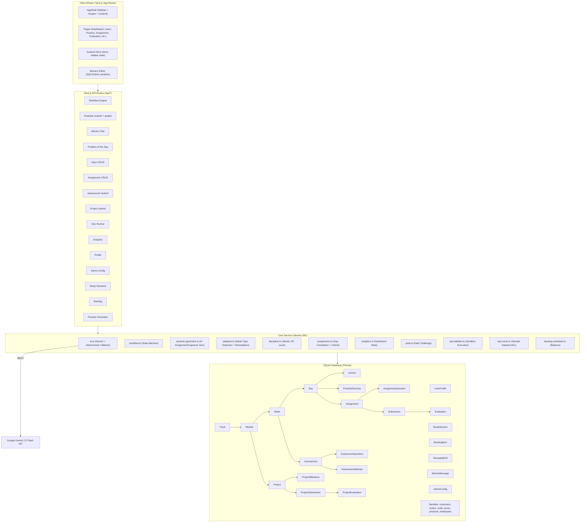

# Praxis OS — Complete Codebase Architecture Analysis

> **Application:** "Praxis OS" — An AI-powered Learning Management System (LMS) styled after a Masai School-style intensive bootcamp, targeting a 12 LPA (₹12,00,000/year) Business Analyst & Analytics Engineer career track.

---

## 1. Technology Stack

| Layer | Technology |
|---|---|
| **Framework** | Next.js 14.2.15 (App Router, React 18) |
| **Language** | TypeScript |
| **Database** | SQLite via Prisma ORM (`prisma/dev.db`) |
| **AI Engine** | Google Gemini 2.5 Flash (REST API, primary) + Rule-based deterministic fallback |
| **State Management** | Zustand (client-side timer/sidebar state) |
| **Styling** | Tailwind CSS 3.4 + custom shadcn/ui components |
| **Code Editor** | Monaco Editor (`@monaco-editor/react`) |
| **Charts** | Recharts |
| **Markdown** | react-markdown + remark-gfm |
| **SQL Sandbox** | sql.js (in-memory) + Prisma `$queryRawUnsafe` (server-side) |
| **Confetti** | canvas-confetti (celebration effects) |
| **Icons** | lucide-react |

---

## 2. High-Level Architecture



---

## 3. Database Schema — Entity Relationships

### Core Curriculum Hierarchy
```
Track (1) → Module (N) → Week (1:1 per module) → Day (N per week)
```

- **Track**: Top-level career track (e.g., "12 LPA Business Analyst Career Track")
- **Module**: 6 modules (SQL, Python, API, Power BI, BRD, Prompt Engineering, etc.) ordered 1–11
- **Week**: One week per module (week number = module order)
- **Day**: ~6 days per module, ~36 total. Has `isUnlocked`, `isCompleted`, `theoryCompleted`, `practiceCompleted`, `score`

### Content per Day
- **Lesson** (1:1): Markdown theory, cheat sheet, quick quiz (JSON), YouTube search query, curated resources
- **PracticeExercise** (1:N): Hands-on drills with problem, starter code, solution, progressive hints
- **Assignment** (1:N): Graded missions with questions, rubric, deadline. **Only Day 1 is seeded; Days 2–66 are AI-generated dynamically** via `dynamic-generator.ts`

### Evaluation Chain
```
Assignment → Submission → Evaluation (score, rubric, strengths, weakAreas, codeDiff, remedialTasks)
```

### Weekly Assessment
```
Week → Assessment → AssessmentQuestion (MCQ or CODE) → AssessmentAttempt (score, passed, skillGaps radar)
```

### Capstone Project
```
Module → Project → ProjectMilestone (7 days) → ProjectSubmission → ProjectEvaluation
```

### Gamification & Discipline
- **UserProfile**: name, XP, level, streak, totalStudyMins, activeDayId, activeModuleId
- **StudySession**: Duration logs tied to timer
- **BacklogItem**: Missed/failed assignments rescheduled
- **RemedialDrill**: Auto-generated practice for weak topics
- **MentorMessage**: Chat history (user ↔ mentor)
- **AdminConfig**: Active AI model, strictness, passing threshold

### Sandbox Data (for SQL execution)
- **Customer, Product, Order, OrderItem, Employee**: Both Prisma-managed (seeded in DB) and in-memory DDL (in `sql-runner.ts`) for the practice sandbox

---

## 4. Core Workflow — Daily Learning Cycle (State Machine)

The heart of the system is the **Workflow Engine** ([workflow.ts](file:///c:/Users/sharu/Downloads/LMS/lib/workflow.ts)). It computes the deterministic "what should the user do right now?" state:

### 4-Step Daily Cycle

| Step | Phase | What Happens |
|---|---|---|
| **1** | `LEARN` | Read theory lesson + pass micro-quiz → marks `theoryCompleted = true` |
| **2** | `PRACTICE` | Complete SQL drills in sandbox → marks `practiceCompleted = true` |
| **3** | `ASSIGNMENT` | Submit graded code against AI rubric. **If no assignment exists, one is dynamically generated by AI** |
| **4** | `EVALUATION` | View AI scorecard. If `passed` (≥70%), day completes → next day unlocks + adaptive assignment generated for it |

### Meta-Cycle Phases

| Phase | Trigger |
|---|---|
| `ASSESSMENT` | All days in a week completed → Monday Weekly Exam (90 min, timed, MCQ + CODE) |
| `PROJECT` | All weeks in a module completed → 7-Day Capstone Project |
| `ALL_DONE` | Entire curriculum finished |

### Workflow State Output
Returns: `currentPhase`, `stepNumber`, `ctaText`, `ctaHref`, `ctaDescription`, `nextPreview`, `hasBacklog`, `assessmentAvailable`, `projectAvailable`, `progress`, `profile`

---

## 5. AI Integration — Dual-Engine Architecture

### Primary: Google Gemini 2.5 Flash
- **[ai.ts](file:///c:/Users/sharu/Downloads/LMS/lib/ai.ts)**: Core `callGemini()` function — POST to `generativelanguage.googleapis.com/v1beta/models/${model}:generateContent`
- **Temperature**: 0.2 (deterministic), **topP**: 0.95
- **Timeout**: 25 seconds with AbortController
- **Model selection**: Reads from `AdminConfig.activeModel` (overridable via admin panel)
- **JSON mode**: `responseMimeType: "application/json"` for structured outputs

### Fallback: Deterministic Rule-Based Engine
Every AI function has a hardcoded fallback if Gemini is unavailable:
- **Code evaluation**: Regex-based scoring (checks for JOIN, GROUP BY, WHERE, OVER, WITH → assigns points)
- **Mentor chat**: Returns a static 4-step framework response
- **Capstone evaluation**: Returns hardcoded 92/100 scores
- **Assignment generation**: Returns template-based assignments per modality

### AI Functions

| Function | Purpose | JSON Output? |
|---|---|---|
| `evaluateAssignmentSubmission()` | 6-dimension rubric scoring (correctness, queryLogic, edgeCases, performance, readability, explanation) | Yes |
| `chatWithMentor()` | 4 modes: Socratic, Debugger, Business, Interview | No (markdown) |
| `evaluateCapstoneProject()` | 7-rubric project evaluation (technical, business, recruiter summary) | Yes |
| `callGemini()` | Raw Gemini API caller | Configurable |

---

## 6. Dynamic Content Generation

### [dynamic-generator.ts](file:///c:/Users/sharu/Downloads/LMS/lib/dynamic-generator.ts)

**`getOrGenerateAssignment(dayId)`**: When a student reaches Step 3 (Assignment) and no assignment exists in DB for that day, this function:
1. Fetches day context (module, week, lesson objective)
2. Detects learner weak areas via `adaptive.ts`
3. Maps module order → modality (SQL, Python, API, Power BI, BRD, etc.)
4. Picks a random company context (Swiggy, Zepto, Razorpay, Netflix, etc.)
5. Calls Gemini to synthesize a realistic industry assignment
6. Persists the assignment + question in DB
7. Falls back to template-based assignment if AI fails

**`getOrGenerateCapstone(moduleId)`**: Similar for 7-day capstone projects.

### [adaptive.ts](file:///c:/Users/sharu/Downloads/LMS/lib/adaptive.ts)

- **`detectWeakTopics()`**: Aggregates scores from evaluations and assessment attempts to identify topics scoring below thresholds (Mastered ≥85, Proficient ≥70, Needs Practice <70)
- **`generateAdaptiveSchedule()`**: Auto-creates `RemedialDrill` records for weak topics
- **`generateAdaptiveAssignmentForNextDay()`**: After a day is completed, adapts the next day's assignment to reinforce weak areas (or escalate difficulty for high performers)

---

## 7. Evaluation Pipeline (`POST /api/evaluate`)

This is the **most complex API route** ([evaluate/route.ts](file:///c:/Users/sharu/Downloads/LMS/app/api/evaluate/route.ts)):

### Pipeline Steps:
1. **Guard**: Reject unchanged starter code (→ score 0)
2. **Deterministic Validation** (0–40 pts):
   - SQL: Executes against SQLite sandbox, compares columns/rows/ordering with reference solution
   - Python: Regex checks for pandas/numpy imports and transformations
   - Power BI: Regex checks for DAX keywords
3. **AI Evaluation** (via Gemini): Full rubric scoring
4. **Score Combination**: `correctness (deterministic) + queryLogic + edgeCases + performance + readability + explanation`. If deterministic = 0, max partial credit = 20%
5. **Save** Submission + Evaluation to DB
6. **Auto-Progression**: If `passed` (≥70%):
   - Mark current day completed
   - Unlock next day
   - Trigger adaptive assignment generation for next day
   - Award +100 XP
7. **Auto-Remediation**: If `!passed`:
   - Create `RemedialDrill` for top weak area
   - Create `BacklogItem` for redo

---

## 8. SQL Sandbox System

### Server-Side ([sql-runner.ts](file:///c:/Users/sharu/Downloads/LMS/lib/sql-runner.ts) + [sql-validator.ts](file:///c:/Users/sharu/Downloads/LMS/lib/sql-validator.ts))
- **Sample dataset**: 7 customers, 6 products, 9 orders, 9 order items, 6 employees — all inserted via DDL SQL
- **Sandbox initialization**: `ensureSandboxTables()` runs DDL statements via `prisma.$executeRawUnsafe()`
- **Query execution**: `POST /api/sql/run` → `prisma.$queryRawUnsafe()` with destructive command guard
- **Validation**: Compares student output vs reference solution on columns, row count, and first-row ordering

### Client-Side
- Monaco Editor for SQL/Python editing
- Results table displayed with execution time

---

## 9. Problem of the Day (POTD)

[potd.ts](file:///c:/Users/sharu/Downloads/LMS/lib/potd.ts): 3 curated problems (Zepto, Swiggy, Razorpay) rotated by day-of-year.
- **Submission**: Validates via `sql-validator.ts`, checks for unchanged starter code
- **Rewards**: +30 min study session + 50 XP + streak increment
- **Tracking**: Completion stored as `StudySession` with `notes: "POTD_COMPLETED:{dateKey}"`

---

## 10. Gamification & Discipline System

### XP Awards
| Action | XP |
|---|---|
| Complete a day (pass evaluation) | +100 |
| POTD solved | +50 |
| Study session (per minute) | +2 |
| Assessment passed | +250 |
| Assessment failed | +50 |
| Capstone submitted | +500 |

### Level System ([discipline.ts](file:///c:/Users/sharu/Downloads/LMS/lib/discipline.ts))
| Level | XP Range | Title |
|---|---|---|
| 1 | 0–500 | Apprentice |
| 2 | 500–1200 | Junior Analyst |
| 3 | 1200–2500 | Analytics Engineer |
| 4 | 2500–5000 | Senior Analytics Engineer |
| 5 | 5000+ | Staff Analytics Architect |

### Streak Calculation
Counts consecutive calendar days with either a `StudySession` or `Submission`. Breaks if neither today nor yesterday has activity.

### Study Timer
Client-side Zustand-based 1-second interval timer. Every 60 accumulated seconds → `POST /api/study-sessions` (1 min). On pause, flushes if ≥30 seconds accumulated.

---

## 11. UI Architecture

### AppShell ([AppShell.tsx](file:///c:/Users/sharu/Downloads/LMS/components/AppShell.tsx))
- **Collapsible sidebar** (hover-to-expand or pin-to-lock)
- **Primary nav**: Dashboard, Daily POTD, Today's Lesson, Practice Sandbox, Assignment, Scorecard
- **Secondary nav**: Curriculum Roadmap, Analytics, AI Mentor, Weekly Assessment, Capstone Project, Remedial Backlog
- **Header**: Breadcrumb + AI Status Badge (shows Gemini model) + Study Timer
- **User profile**: Hardcoded "Sharun / SK" initials

### Key Pages (22 total)
| Page | Size | Role |
|---|---|---|
| `/dashboard` | 33KB | Central hub: workflow state, CTA hero, stepper, analytics, assignments, activity chart |
| `/learn/[moduleId]/[dayId]` | 27KB | Theory lesson, cheat sheet, micro-quiz, YouTube resources |
| `/practice/[dayId]` | 25KB | Monaco editor sandbox, run queries, schema viewer, progressive hints |
| `/assignment/[assignId]` | 38KB | Monaco editor, submit code, view evaluation inline |
| `/daily-challenge` | 18KB | POTD SQL challenge with timer and test results |
| `/assessment/[assessId]` | 20KB | Timed exam (MCQ + CODE questions), submit all |
| `/assessment/[assessId]/report` | 18KB | Score report, skill radar chart, per-question breakdown |
| `/evaluation/[subId]` | 17KB | Detailed rubric scorecard, strengths/weaknesses, code diff, remedial |
| `/mentor` | 13KB | AI chat with 4 modes (Socratic, Debugger, Business, Interview) |
| `/projects/[projId]` | 16KB | Capstone project milestones, submit deliverables |
| `/projects/[projId]/evaluation` | 12KB | Project evaluation with recruiter summary |
| `/roadmap` | 7.5KB | Curriculum tree view (renders via RoadmapClient, 44KB) |
| `/backlog` | 11KB | Backlog items + remedial drills, mark complete, balance schedule |
| `/analytics` | 130B | Redirect page |
| `/onboarding` | 7KB | Profile setup wizard |
| `/admin/studio` | 7KB | Admin panel: change AI model, strictness, passing threshold |

### Dashboard Components (16 total)
MissionHeroCard, DailyStepper, PersonalStatsCard, ActiveLessonCard, AssignmentCard, StudyGoalCard, CurriculumGaugeChart, LearningGaugeChart, DashboardAnalyticsSection, RecentSubmissionsTable, TodoListWidget, QuickActionPills, TopLearnersCard, MostIssuedCard, ProUpgradeCard, UngradedQuizTable

---

## 12. API Route Map (18 endpoints)

| Route | Methods | Purpose |
|---|---|---|
| `/api/admin/config` | GET, PATCH | Admin model/strictness config |
| `/api/ai/status` | GET | Check Gemini connectivity |
| `/api/analytics` | GET | Full analytics dashboard data |
| `/api/assessments/[assessId]` | GET | Fetch assessment + questions |
| `/api/assessments/[assessId]/submit` | POST | Submit exam answers, grade MCQ + CODE |
| `/api/assignments/generate` | POST | Trigger AI assignment generation |
| `/api/assignments/[assignId]` | GET | Fetch assignment details |
| `/api/assignments/[assignId]/submissions` | GET | Fetch submission history |
| `/api/backlog` | GET, POST, PATCH | Backlog + remedial drill CRUD |
| `/api/backlog/balance` | POST | Smart schedule rebalancer |
| `/api/days/[dayId]` | GET, PATCH | Day data + update theory/practice flags |
| `/api/discipline/streak` | GET | Calculate and return streak |
| `/api/evaluate` | POST | **Core**: Submit assignment → deterministic + AI eval → progression |
| `/api/mentor/chat` | GET, POST | AI mentor conversation |
| `/api/ollama/status` | GET | Legacy Ollama status (redirects to AI) |
| `/api/potd` | GET, POST | Problem of the Day fetch + submit |
| `/api/practice/generate` | POST | AI-generate new practice drill |
| `/api/profile` | GET, PATCH | User profile CRUD |
| `/api/projects/generate` | POST | Generate capstone via AI |
| `/api/projects/[projId]` | GET, PATCH, POST | Project details + milestone update + submit |
| `/api/projects/[projId]/submit` | POST | Capstone submission + AI evaluation |
| `/api/sql/run` | POST | Execute SQL in sandbox |
| `/api/study-sessions` | GET, POST | Study session logging |
| `/api/submissions/[subId]` | GET | Fetch submission + evaluation |

---

## 13. Data Flow — End-to-End User Journey

```mermaid
graph LR
    A["Dashboard loads"] --> B["getWorkflowState()"]
    B --> C{"currentPhase?"}
    C -->|LEARN| D["Open /learn/[mod]/[day]"]
    D --> E["Read theory + Pass micro-quiz"]
    E --> F["PATCH /api/days → theoryCompleted=true"]
    F --> G["Redirect to /practice/[dayId]"]
    G --> H["Complete SQL drills"]
    H --> I["PATCH /api/days → practiceCompleted=true"]
    I --> J{"Assignment exists?"}
    J -->|No| K["getOrGenerateAssignment() → AI creates one"]
    J -->|Yes| L["Open /assignment/[id]"]
    K --> L
    L --> M["Submit code → POST /api/evaluate"]
    M --> N["Deterministic SQL validation (0-40 pts)"]
    N --> O["Gemini AI rubric evaluation"]
    O --> P["Combine scores → passed?"]
    P -->|Yes ≥70%| Q["Mark day complete, unlock next day, +100 XP, generate adaptive next assignment"]
    P -->|No <70%| R["Create RemedialDrill + BacklogItem"]
    Q --> S["View /evaluation/[subId] scorecard"]
    R --> S
    S --> T["Back to Dashboard → next phase"]
```



---

## 14. Identified Limitations & Inconsistencies

### Architectural Issues
1. **Single-user design**: `UserProfile.findFirst()` is used everywhere — no authentication, no multi-user support. The entire system assumes a single learner named "Sharun".
2. **Hardcoded user data in UI**: AppShell displays "Sharun / SK" initials and "12 LPA Track" regardless of profile data.
3. **`ollama.ts` is a dead re-export**: Just re-exports from `ai.ts`. The Ollama fallback env vars exist but are never used.
4. **Duplicate project submission routes**: Both `/api/projects/[projId]` (POST) and `/api/projects/[projId]/submit` (POST) do the same thing — submit a capstone with evaluation.

### Data & Logic Issues
5. **Week ↔ Module is 1:1**: Each module creates exactly 1 week, so the "weekly assessment" is really a "module assessment". The schema supports N weeks per module but the seed creates only 1.
6. **Day unlock looks across all weeks**: `nextDay` is found by `dayNumber + 1` globally, not scoped to the current week — could unlock a day in the wrong module.
7. **Assessment questions are identical**: All 6 weekly assessments get the same 3 hardcoded questions (Star Schema MCQ, Window Frame MCQ, DENSE_RANK CODE).
8. **Deterministic fallback gives generous scores**: The rule-based evaluator gives 85 max for syntactically complex queries, and the capstone fallback always returns 92%.
9. **XP awarded multiple times**: Both the `evaluate` route AND the `days PATCH` route award +100 XP when a day is completed, potentially doubling XP.
10. **`sql-validator.ts` creates its own PrismaClient**: Instead of using the shared singleton from `db.ts`, creating potential connection issues.

### Missing Features
11. **No real authentication/authorization** — anyone can access admin config
12. **No rate limiting on AI calls** — could exhaust API quota
13. **Study timer doesn't persist across page reloads** (Zustand in-memory only)
14. **Backlog balance distributes round-robin but ignores daily capacity** (max 2 per day claim in PRD, but not enforced in code)
15. **Assessment has no timed enforcement server-side** — timer is client-side only
16. **`adaptiveReason` on seeded baseline topics uses static SQL defaults** even for Python/API/POWER_BI modules

---

## 15. Curriculum Data

The curriculum is defined in [curriculum-data.mjs](file:///c:/Users/sharu/Downloads/LMS/prisma/curriculum-data.mjs) (113KB) and imported by the seed script. It contains:
- 1 Track: "12 LPA Business Analyst Career Track"
- 6+ Modules covering SQL, Python, REST APIs, Power BI, BRD, Prompt Engineering, etc.
- Each module has ~6 days with: title, objective, practice problem, starter code, solution, YouTube search query, curated video links, and checklists
- Total: ~36–66 days of content

---

## 16. Configuration Files

| File | Purpose |
|---|---|
| [next.config.mjs](file:///c:/Users/sharu/Downloads/LMS/next.config.mjs) | Disables `fs`, `path`, `crypto` fallbacks for webpack (client-side). Allows Unsplash images. |
| [tailwind.config.ts](file:///c:/Users/sharu/Downloads/LMS/tailwind.config.ts) | Custom "masai" color palette (red, dark, accent, emerald, amber, purple). CSS variable-based design tokens. Custom glow shadows. |
| [tsconfig.json](file:///c:/Users/sharu/Downloads/LMS/tsconfig.json) | Standard Next.js TS config with `@/` path alias |
| [.env.local](file:///c:/Users/sharu/Downloads/LMS/.env.local) | Gemini API key + model, Ollama fallback URL (unused) |
| [components.json](file:///c:/Users/sharu/Downloads/LMS/components.json) | shadcn/ui config (using `@base-ui/react` v1.8) |

---

## Summary

**Praxis OS** is a comprehensive, single-user, AI-powered bootcamp LMS with a rich 4-step daily learning cycle (Learn → Practice → Assignment → Evaluation), weekly assessments, 7-day capstone projects, a Socratic AI mentor, adaptive learning based on weak topic detection, a gamification system (XP, levels, streaks), and a built-in SQL sandbox. The AI layer uses Google Gemini 2.5 Flash with intelligent deterministic fallbacks for every function. Assignments for days 2+ are dynamically generated by AI based on the learner's progress and weak areas. The entire system is local-first (SQLite) with no authentication.
