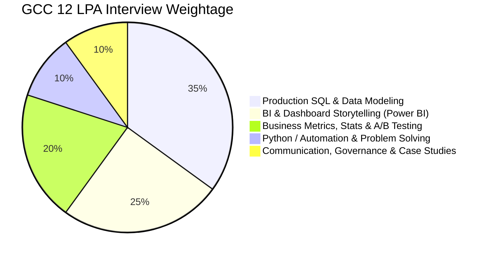
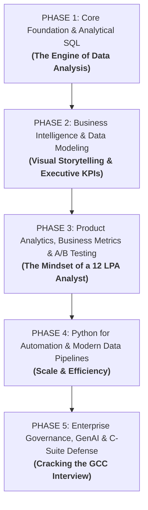

# 🎯 Praxis OS — Data Analyst GCC Roadmap (Target: 12 LPA | Nov 2027)

> **Profile Target:** Data Analyst / Product Analyst / Business Intelligence Analyst  
> **Target Companies:** Top Global Capability Centers (GCCs) — e.g., JPMorgan Chase, Goldman Sachs, Wells Fargo, American Express, Walmart Global Tech, Target Enterprise, Fidelity, Shell, Novartis, Lowe's  
> **Starting Point:** Complete Beginner (Zero Prior Analytics / Coding Experience)  
> **Timeline:** Clear, Progressive Phased Mastery

---

## 1. Current LMS Curriculum Audit & Critical Review

Current LMS mein total **11 Modules (66 Days)** hain. Aayiye dekhte hain ki abhi kya structure hai aur ek absolute beginner ke liye isme kya challenges hain:

| Mod # | Current Title | Current Scope | Beginner Suitability Assessment |
|---|---|---|---|
| **Mod 1** | Production SQL & Analytical Data Modeling (Days 1–6) | Joins, Window Functions, CTEs, Cohorts, Execution Plans | ⚠️ **Too Steep on Day 1.** Starts directly with complex multi-table joins and fan-outs without covering basic `SELECT`, `WHERE`, `GROUP BY`, or foundational database concepts. |
| **Mod 2** | Python for Data Analysis & Automation (Days 7–12) | NumPy, Pandas, Data Cleaning, Merging, Financial ETL | ⚠️ **Steep Curve.** Assumes prior programming or rapid syntax pickup. Needs foundational Python logic before vectorization and ETL. |
| **Mod 3** | System Architecture, APIs & Integration (Days 13–18) | Microservices, REST APIs, JSON Schema, Postman, Webhooks | ℹ️ **More Tech-BA than DA.** Useful for modern data ingestion, but placed too early before BI/dashboards are mastered. |
| **Mod 4** | Enterprise BI, Star Schemas & Advanced DAX (Days 19–24) | Power BI, Star Schema, CALCULATE, Time Intelligence, Dashboards | ⭐ **Core DA Pillar.** High priority for GCCs, but should be sequenced right after SQL/Data Modeling concepts. |
| **Mod 5** | Business Systems Analysis, BRD/FRD & Agile (Days 25–30) | BRD, FRD, BPMN 2.0, User Stories, Scrum | ℹ️ **Traditional BA Focus.** GCC Data Analysts need Agile/Scrum & metric definitions, but deep BRD/FRD writing is secondary to SQL + BI. |
| **Mod 6** | AI-Augmented BA Workflows (Days 31–36) | Prompt Engineering, Meeting notes to specs, SQL reverse-engineering | ⭐ **High Value Accelerator.** Teaching how to use Gemini/ChatGPT to write SQL, clean data, and debug code. |
| **Mod 7** | AI/ML Fundamentals & GenAI Design (Days 37–42) | Supervised/Unsupervised, Metrics (ROC-AUC), RAG, GenAI PRDs | ℹ️ **Conceptual AI Literacy.** Good for knowing ML evaluation metrics, but should come after core analytical stats. |
| **Mod 8** | Data Governance, Privacy & AI Compliance (Days 43–48) | DPDP 2023, GDPR, PII Masking, Data Lineage, Data Catalogs | ⭐ **GCC Goldmine.** GCCs handle sensitive global customer data; governance & PII masking are top interview questions. |
| **Mod 9** | Change Management & Digital Transformation (Days 49–54) | ADKAR framework, Stakeholder resistance, SOPs | ℹ️ **Consulting Heavy.** Good for leadership, but lower priority for initial entry-level 12 LPA DA screening rounds. |
| **Mod 10** | Product Analytics, A/B Testing & Unit Economics (Days 55–60) | AARRR Funnel, CAC/LTV, A/B Testing, P-Values, Cohorts | ⭐⭐ **Top-Tier GCC Must-Have.** Every modern GCC analytics team evaluates product metrics and statistical experiments. |
| **Mod 11** | C-Suite Consulting & Interview Grilling (Days 61–66) | Minto Pyramid, Market Sizing, RCA, Case Studies, Portfolio | ⭐⭐⭐ **Final Boss.** The exact differentiator that converts 6 LPA candidates into 12 LPA offers. |

---

## 2. GCC Data Analyst Hiring Reality (What Top GCCs Look For)

Top Global Capability Centers (GCCs) do **not** expect you to build deep neural networks from scratch. Instead, their 12 LPA interviews test 4 core dimensions:

1. **Rock-Solid SQL (35% Weightage):** Window functions, complex CTEs, aggregation with filters, and query performance. If your SQL cracks, you crack the screening.
2. **Business Intelligence & Data Modeling (25% Weightage):** Star Schemas, Fact vs Dimension tables, DAX measures (CALCULATE, Time Intelligence), clean visual hierarchy.
3. **Product Metrics & Statistical Rigor (20% Weightage):** CAC, LTV, Churn, Retention cohorts, A/B testing hypothesis, p-values, sample size sizing.
4. **Python & Data Wrangling (10% Weightage):** Pandas, data cleansing, handling missing values, automated reporting.
5. **Business Acumen, Communication & Governance (10% Weightage):** Explaining insights to non-technical stakeholders, DPDP/PII ethics, Minto Pyramid storytelling.

---

## 3. The Reorganized Beginner-to-GCC Learning Plan

Yahan hum curriculum ko **5 Phased Stages** mein re-sequence kar rahe hain. Har stage pichle stage par build karti hai taaki zero-background learner confuse na ho.

---

### 🟢 PHASE 1: Data Foundations & Production SQL
*Pehle data ko nikalna, filter karna aur aggregate karna seekho.*

- **Original Module:** Module 1 (with pre-requisite basic queries)
- **Topics Covered:**
  - Day 1: Relational Database Concepts, Primary/Foreign Keys & Multi-Table Joins without traps
  - Day 2: Window Functions (`ROW_NUMBER`, `RANK`, `DENSE_RANK`, `LEAD`, `LAG`)
  - Day 3: Common Table Expressions (CTEs) & Subqueries for modular pipelines
  - Day 4: Conditional Aggregations (`CASE WHEN`), Pivots & Handling `NULL`s
  - Day 5: Real-World Business Metrics: 30-Day Cohort Retention & Churn Curve SQL
  - Day 6: Query Optimization, Indexing, Execution Plans & Performance Tuning
- **GCC Interview Checkpoint:** Live SQL coding round — LeetCode/HackerRank medium SQL questions.

---

### 🔵 PHASE 2: Enterprise BI, Star Schemas & Executive Dashboards
*Data nikaal liya, ab use business executives ke liye visually present karo.*

- **Original Module:** Module 4
- **Topics Covered:**
  - Day 7 (Original D19): Star Schema Modeling, Fact Tables vs Dimension Tables, Granularity
  - Day 8 (Original D20): DAX Core Fundamentals: Calculated Columns vs Measures & Evaluation Context
  - Day 9 (Original D21): The `CALCULATE` engine & Filter Context modification (`FILTER`, `ALL`, `ALLEXCEPT`)
  - Day 10 (Original D22): Time Intelligence Functions (YTD, QTD, MoM, YoY Growth Metrics)
  - Day 11 (Original D23): Semi-Additive Measures & Parent-Child Hierarchy Aggregations
  - Day 12 (Original D24): Executive Storyboarding, Drill-Throughs, UI Design & Power BI Copilot
- **GCC Interview Checkpoint:** Portfolio project: Interactive Executive Financial or Retail KPI Dashboard with Star Schema & DAX.

---

### 🟣 PHASE 3: Product Analytics, Unit Economics & A/B Testing
*Sirf charts banana kaafi nahi hai — business numbers kaise move hote hain woh seekho.*

- **Original Module:** Module 10
- **Topics Covered:**
  - Day 13 (Original D55): AARRR Pirate Funnel & Product North Star Metrics
  - Day 14 (Original D56): Unit Economics: Customer Acquisition Cost (CAC), Payback & Margins
  - Day 15 (Original D57): Customer Lifetime Value (LTV), Churn Rates & LTV:CAC Ratio
  - Day 16 (Original D58): A/B Testing Foundations: Hypothesis Formulation, Sample Sizing & Statistical Power
  - Day 17 (Original D59): Statistical Significance, P-Values, T-Tests, Confidence Intervals & Pitfalls
  - Day 18 (Original D60): Customer Segmentation (RFM: Recency, Frequency, Monetary) & Cohort Profitability
- **GCC Interview Checkpoint:** Product analytics case study round: "A feature release dropped checkout conversion by 4%, how will you diagnose and test this?"

---

### 🟡 PHASE 4: Python for Data Analysis & Automated Pipelines
*Jab dataset Excel ya BI tool mein heavy ho jaye, tab code se scale karo.*

- **Original Modules:** Module 2 + Module 3 (selective essentials)
- **Topics Covered:**
  - Day 19 (Original D7): Python Data Structures (Lists, Dicts) & NumPy Foundations
  - Day 20 (Original D8): Pandas DataFrames: Ingestion, Filtering, Slicing & Types
  - Day 21 (Original D9): Data Wrangling, Missing Value Imputation & Outlier Detection
  - Day 22 (Original D10): Advanced GroupBy, Aggregations, Pivot Tables & Reshaping
  - Day 23 (Original D11): Multi-Source Joins, Reconciliation Automation & API Data Pulls (REST APIs / JSON)
  - Day 24 (Original D12): End-to-End Automated ETL & Scheduled Reporting Script
- **GCC Interview Checkpoint:** Python live task: Data cleaning script that handles messy CSVs and generates automated summary stats.

---

### 🔴 PHASE 5: Governance, GenAI Workflows & C-Suite Interview Grilling
*Top 1% elite profile bano jo ordinary analysts se alag dikhe.*

- **Original Modules:** Module 8 + Module 6 + Module 7 (DA essentials) + Module 11
- **Topics Covered:**
  - Day 25 (Original D43–45): Data Governance, PII Masking & Data Privacy Regulations (DPDP 2023 / GDPR)
  - Day 26 (Original D31, 34): AI-Augmented Analytics: Prompt Engineering for SQL Generation & Code Refactoring
  - Day 27 (Original D37–39): Machine Learning Literacy for Analysts: Classification, Regression, Precision/Recall & Business Framing
  - Day 28 (Original D61): The McKinsey Minto Pyramid: Top-Down Business Communication
  - Day 29 (Original D62–63): Market Sizing, Root Cause Analysis (Fishbone/5-Whys) & Decision Trees
  - Day 30 (Original D64–66): Executive Deck Synthesis, Rigorous Mock Interview Grilling & Portfolio Defense
- **GCC Interview Checkpoint:** Final Partner/Director Round: Presenting your end-to-end Capstone case study with business impact numbers.

---

## 4. Key Takeaway & Immediate Next Action

| Aspect | Current LMS State | Reorganized Plan |
|---|---|---|
| **Starting Point** | Hardcore SQL joins immediately | Structured data logic → SQL → Power BI → Business Stats |
| **Target Role Alignment** | Mix of Business Analyst (BRD/FRD) & Engineer | Pure **High-Impact Data Analyst / BI Analyst** for Tier-1 GCCs |
| **Complexity Progression** | Scattered difficulty peaks | Smooth linear progression from beginner to 12 LPA professional |
| **Portfolio Deliverables** | Generic assignments | 3 GCC-Ready Showcase Projects (SQL Analytics, Power BI Star Schema, Product Growth A/B Test) |
